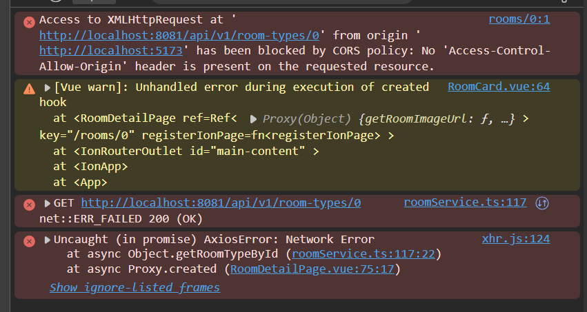
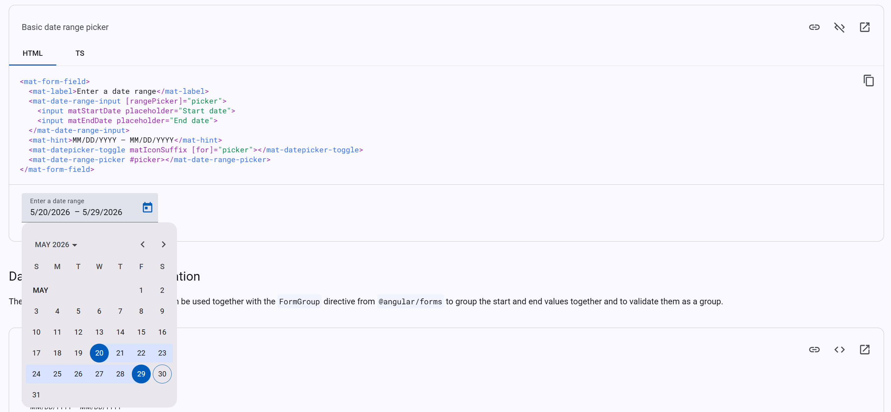

# AI Usage Report

## API-Specification
we worked out an initial draft of our api specification, and let claude sonnet 4.6 refine it into our current [Api Specification](/docs/API-Specification.md).

## Room Details Page
### CSS
Claude Sonnet 4.6:
- Invert PNG color for dark/light themes
- Change the font/background so the contrast is better for dark/light themes

### CORS Error
Claude Sonnet 4.6:
- 
- added [WebConfig.java](../MSE26-Hotel-CopyCat/src/main/java/com/mse26/hotelcopycat/config/WebConfig.java)
- move multiple CORS allowedOrigins into application.properties

## Check Availability
### CSS
Claude Sonnet 4.6:
- availability badge on room cards
- Unavailable badge not in greyscale

### Datepicker UX Rework
Claude Sonnet 4.6:
- research for daterange-pickers (similar to angular materials')

- remove timestamp from vue daterange picker input
- the entirety of the styling of the reworked [DateRangePicker.vue](../MSE26-HotelCopyCat-Frontend/src/components/date/DateRangePicker.vue) component was done via AI
  - done so since the single datepicker was more of a UX/QOL addition to the code, and it had also worked before the rework
  - tedious task of adapting the style to fit ionics (in light/dark mode)

## Add Components
Claude Sonnet 4.6:
- find code duplication for potential component-ification(?)
- evaluate benefit of turning certain things into components
  - e.g spinner, pagelayout, etc