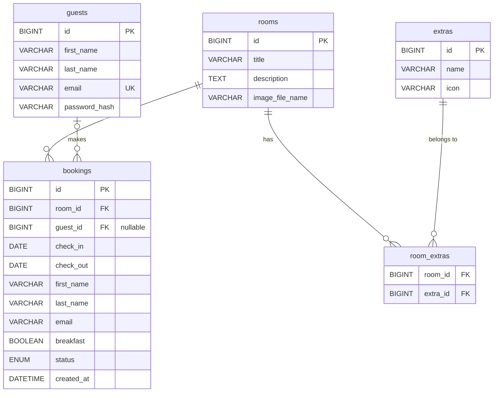

```mermaid
erDiagram
    guests {
        BIGINT id PK
        VARCHAR first_name
        VARCHAR last_name
        VARCHAR email UK
        VARCHAR password_hash
    }

    rooms {
        BIGINT id PK
        VARCHAR title
        TEXT description
        VARCHAR image_file_name
    }

    extras {
        BIGINT id PK
        VARCHAR name
        VARCHAR icon
    }

    room_extras {
        BIGINT room_id FK
        BIGINT extra_id FK
    }

    bookings {
        BIGINT id PK
        BIGINT room_id FK
        BIGINT guest_id FK "nullable"
        DATE check_in
        DATE check_out
        VARCHAR first_name
        VARCHAR last_name
        VARCHAR email
        BOOLEAN breakfast
        ENUM status
        DATETIME created_at
    }

    rooms ||--o{ room_extras : "has"
    extras ||--o{ room_extras : "belongs to"
    rooms ||--o{ bookings : "booked via"
    guests |o--o{ bookings : "makes"
```