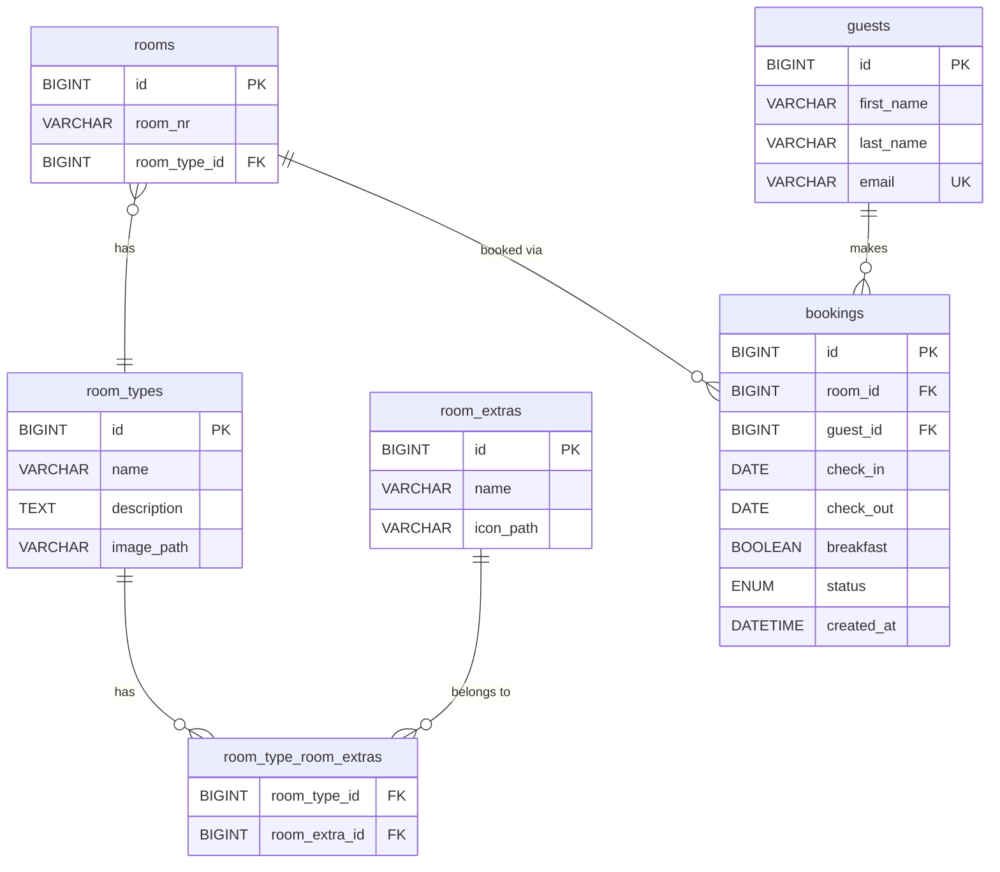

```mermaid
erDiagram
    guests {
        BIGINT id PK
        VARCHAR first_name
        VARCHAR last_name
        VARCHAR email UK
    }

    rooms {
        BIGINT id PK
        VARCHAR room_nr
        BIGINT room_type_id FK
    }

    room_types {
        BIGINT id PK
        VARCHAR name
        TEXT description
        VARCHAR image_path
    }

    room_extras {
        BIGINT id PK
        VARCHAR name
        VARCHAR icon_path
    }

    room_type_room_extras {
        BIGINT room_type_id FK
        BIGINT room_extra_id FK
    }

    bookings {
        BIGINT id PK
        BIGINT room_id FK
        BIGINT guest_id FK
        DATE check_in
        DATE check_out
        BOOLEAN breakfast
        ENUM status
        DATETIME created_at
    }

    rooms }o--|| room_types : "has"
    room_types ||--o{ room_type_room_extras : "has"
    room_extras ||--o{ room_type_room_extras : "belongs to"
    rooms ||--o{ bookings : "booked via"
    guests ||--o{ bookings : "makes"
```